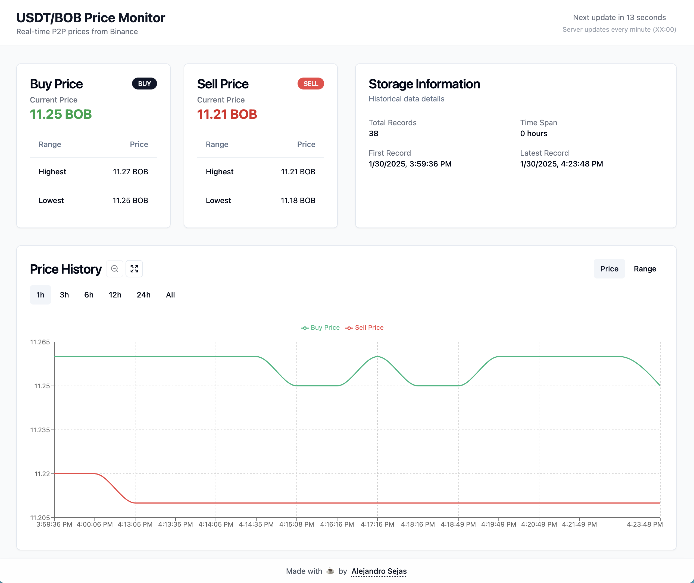

# Binance BOB/USDT Price Tracker

A real-time price tracking application for the Boliviano (BOB) to USDT trading pair on Binance P2P market. This project provides a visual and interactive way to monitor price trends and ranges in the Bolivian cryptocurrency market.

## 🚀 Live Demo

Visit the live application at: [https://alejandrosejas.github.io/binance-bob-usdt](https://alejandrosejas.github.io/binance-bob-usdt)



## 🌟 Features

- **Real-time Price Tracking**:
  - Automatic server-side price updates every minute
  - Server-Sent Events (SSE) for instant client updates
  - Synchronized countdown timer showing next update time
- **Interactive Charts**:
  - Zoom-capable price history visualization
  - Multiple time range options (1h, 3h, 6h, 12h, 24h, All)
  - Price and range view modes
  - Fullscreen support
- **Detailed Price Information**:
  - Current buy/sell prices
  - Historical high/low ranges
  - Price history persistence
  - Storage usage monitoring
- **Responsive Design**:
  - Optimized for mobile, tablet, and desktop
  - Adaptive layout and components
  - Touch-friendly interactions

## 🏗️ Architecture

- **Frontend**: React SPA with TypeScript
- **Backend**: Express.js proxy server
- **Data Flow**:
  1. Server fetches prices from Binance P2P every minute
  2. Price data is stored in-memory with 1000 points history
  3. Updates are pushed to clients via SSE
  4. Clients maintain local storage backup

## 🛠️ Tech Stack

- **Frontend**:
  - React + TypeScript
  - Tailwind CSS
  - Shadcn/ui components
  - Recharts for data visualization
  - Framer Motion for animations
- **Backend**:
  - Express.js
  - Server-Sent Events
  - Axios for API requests
- **Build & Deploy**:
  - Vite
  - GitHub Pages (Frontend)
  - Render.com (Backend)


## 💻 Development

1. Clone the repository:

   ```bash
   git clone https://github.com/alejosejas/binance-bob-usdt.git
   cd binance-bob-usdt
   ```

2. Install dependencies:

   ```bash
   # Install frontend dependencies
   npm install

   # Install backend dependencies
   cd proxy-server
   npm install
   ```

3. Start the development servers:

   ```bash
   # Start frontend (in root directory)
   npm run dev

   # Start backend (in proxy-server directory)
   npm run dev
   ```

4. Build for production:
   ```bash
   npm run build
   ```

## 📝 Project Structure

```
├── src/                  # Frontend source code
│   ├── components/       # React components
│   ├── hooks/           # Custom React hooks
│   ├── lib/             # Utility functions
│   ├── pages/           # Page components
│   └── services/        # API services
├── proxy-server/        # Backend server code
│   ├── server.js        # Express server setup
│   └── package.json     # Backend dependencies
└── media/              # Screenshots and assets
```

## 🤝 Contributing

Feel free to open issues and pull requests for any improvements you'd like to contribute.

## 📄 License

MIT License - feel free to use this project for your own purposes.

## 👨‍💻 Author

Made with ☕️ by Alejandro Sejas
